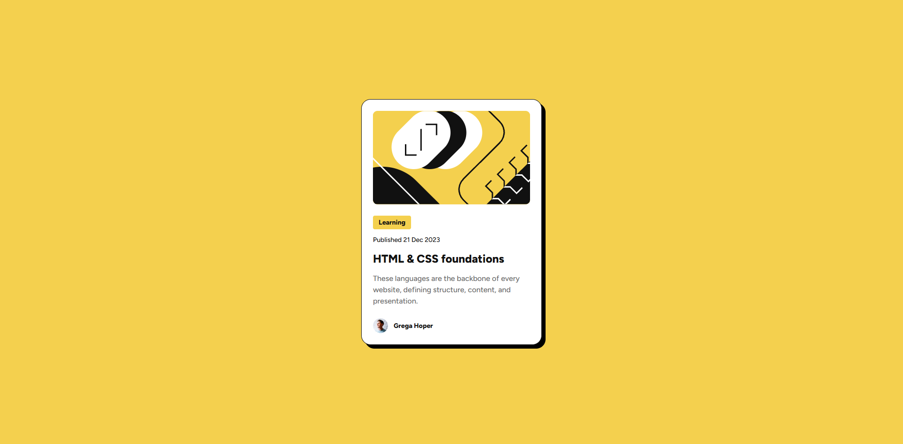

# Frontend Mentor - Blog preview card solution

This is a solution to the [Blog preview card challenge on Frontend Mentor](https://www.frontendmentor.io/challenges/blog-preview-card-ckPaj01IcS). Frontend Mentor challenges help you improve your coding skills by building realistic projects.

## Table of contents

- [Overview](#overview)
  - [Screenshot](#screenshot)
  - [Links](#links)
- [My process](#my-process)
  - [Built with](#built-with)
  - [What I learned](#what-i-learned)
  - [Continued development](#continued-development)
  - [Useful resources](#useful-resources)
- [Author](#author)
- [Acknowledgments](#acknowledgments)

## Overview

### Screenshot



### Links

- Solution URL: [Add solution URL here](https://your-solution-url.com)
- Live Site URL: [Add live site URL here](https://your-live-site-url.com)

## My process

### Built with

- Semantic HTML5 markup
- CSS custom properties
- Flexbox
- SCSS (Sass)
- Mobile-first workflow
- [Figtree](https://fonts.google.com/specimen/Figtree) - Google Font

### What I learned

This project was a great opportunity to practice modern CSS techniques and workflow improvements.

- **SCSS Implementation**: I transitioned the project from standard CSS to SCSS, as suggested by a member of the community. I appreciate it, as I found it incredibly insightful. This allowed me to use variables for colors and spacing, making the code more maintainable. I also utilized nesting to mirror the HTML structure, which improved readability.

- **Responsive Design**: I learned the importance of avoiding fixed dimensions on container elements. Initially, the card wasn't responsive because the `body` had a fixed width and height. I fixed this by using `min-height: 100vh` and allowing the content to determine the width, ensuring the card centers correctly on all screen sizes.

- **Image Handling**: One specific challenge was ensuring the SVG illustration respected the card's border radius. I solved this by applying `overflow: hidden` to the parent container:

```css
.image-container {
  border-radius: 0.625rem;
  overflow: hidden; /* Crucial for clipping the image */
}

.image-container img {
  width: 100%;
  object-fit: cover;
}
```

### Continued development

I want to continue refining my SCSS workflow and exploring more advanced responsive design patterns.

### Useful resources

- [Sass Documentation](https://sass-lang.com/documentation/) - Helpful for understanding SCSS syntax and features.
- [MDN Web Docs - CSS Flexbox](https://developer.mozilla.org/en-US/docs/Web/CSS/CSS_Flexible_Box_Layout/Basic_Concepts_of_Flexbox) - A comprehensive guide to understanding Flexbox layouts.
- [A Complete Guide to Flexbox (CSS-Tricks)](https://css-tricks.com/snippets/css/a-guide-to-flexbox/) - My go-to cheat sheet for Flexbox properties.
- [Google Fonts - Figtree](https://fonts.google.com/specimen/Figtree) - The font family used in this project.

## Author

- GitHub - [Arturo Guerrero](https://github.com/arturoguerreronc)
- Frontend Mentor - [@arturoguerreronc](https://www.frontendmentor.io/profile/arturoguerreronc)

## Acknowledgments

Thanks to Frontend Mentor for providing this challenge.
